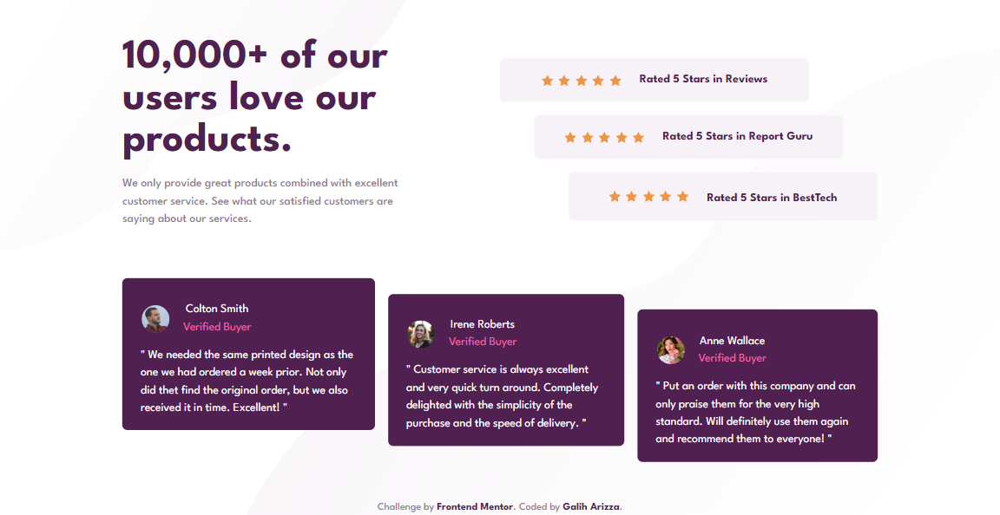

# Frontend Mentor - Social proof section solution

This is a solution to the [Social proof section challenge on Frontend Mentor](https://www.frontendmentor.io/challenges/social-proof-section-6e0qTv_bA). Frontend Mentor challenges help you improve your coding skills by building realistic projects.

## Table of contents

- [Overview](#overview)
  - [The challenge](#the-challenge)
  - [Screenshot](#screenshot)
  - [Links](#links)
- [My process](#my-process)
  - [Built with](#built-with)
- [Author](#author)

## Overview

### The challenge

Users should be able to:

- View the optimal layout for the section depending on their device's screen size

### Screenshot

### Links

- Solution URL: [https://github.com/chadittya/social-proof-section-master-react](https://github.com/chadittya/social-proof-section-master-react)
- Live Site URL: [https://chadittya.github.io/social-proof-section-master-react](https://chadittya.github.io/social-proof-section-master-react)

## My process

### Built with

- Flexbox
- Mobile-first workflow
- [React](https://reactjs.org/) - JS library
- [Vite js](https://vitejs.dev/) - React framework
- [Tailwind CSS](https://tailwindcss.com/) - For styles

## Author

- Github - [chadittya](https://github.com/chadittya)
- Frontend Mentor - [@chadittya](https://www.frontendmentor.io/profile/chadittya)
- Twitter - [@galiharizza](https://www.twitter.com/galiharizza)
